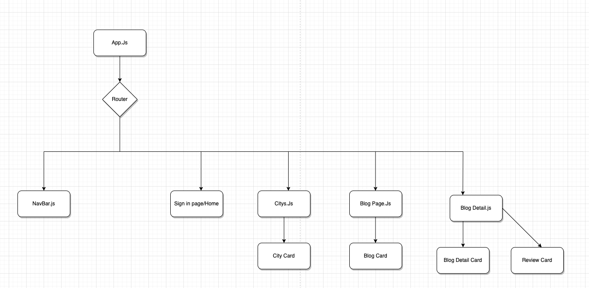

# Travel-Blog

## Date 02/07/21

## Nashid Alam

[LinkedIn](https://www.linkedin.com/in/nashid-alam/) | [Github](https://github.com/Nashid-Alam) | [Trello](https://trello.com/b/b7hdGfAo/travel-blog)
*** 

## Description
Have you ever wanted to travel to a destination but did not feel comfortable choosing that location due to lack of knowledge regarding that area. Travel Blog will help you by getting the nitty gritty of travel from your trusted friends without having to ask them about all the details of their travels. All in one App.

## Technologies Used
This project is made with:
* PostgreSQL
* Django
* React

## Getting Started with Sell8
- As you visit the app, you will see an option to login in/register on the landing page. On the city page will be a list of all the cities that have a travel post and there will be an option to make a post as well. A User can go to create a Post to create a blog about a destination by adding a City and a Travel Post regarding that city. Then other users can post comments and reviews regarding that post.

## Screenshots of the App
> screenshots will go here

  
Entity Relationship Diagram

  

  
Component Hierarchy Diagram

  

## Future Updates
- [ ] Trends
- [ ] Follow

## Credits
